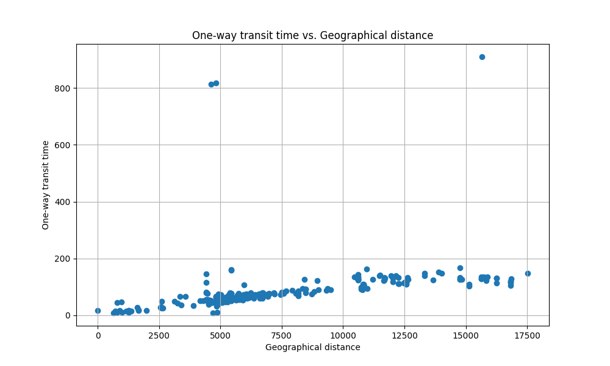

# Traceroute Analysis

This is a python script to analyze the output of the command `traceroute`. It
plots a graph comparing distance to server and number hops and a graph comparing
distance to server and the time taken to travel (one-way).

## How to use

1. Ensure you have the `python` interpreter and `matplotlib` library installed.

2. Create an account on [IpStack](https://ipstack.com/) to obtain an API key
   which will be used to find the geolocation of a server.

3. Add your API key to a file named `ipstack-api-key.txt` with just your key in
   it.

4. Create a file with the coordinates (latitude and longitude) of your source
   machine named `source-location.txt`. Have the latitude and longitude comma
   separated. Example: `12.3515, 13.4562`. For best result use precise latitude
   and longitude values.
5. Run the program for a certain number of values, example: `python
   traceroute-script.py 10`. This will pick 10 random URLs from the
   `arch-mirror-list.txt` and perform `traceroute` on them.

6. View the results as either the generated CSV file or the two generated
   graphs. The files will be named `graph1.png`, `graph2.png`, and
   `output-table.csv`.

## References

1. The list of Arch Linux Mirrors is used
   ([https://wiki.archlinux.org/title/mirrors](https://wiki.archlinux.org/title/mirrors))
   as a source of URLs since it has servers present all over the world. The list
   included in the repository was generated around 2023-09-09.

2. [IpStack](https://ipstack.com/) is used for it's API that can determine the
   geolocation of a particular IP Address. It's free to create an account.

3. [https://www.movable-type.co.uk/scripts/latlong.html] this URL was used as
   the formula to find the distance between two coordinates on Earth. It uses
   the 'haversine' formula.

## Conclusions On Experiment

Personally, I found that by running the script for a value of `300`, I found a
strong correlation between distance and time to reach but the correlation
between distance and number of hops seem to be pretty weak. There is some
correlation between distance and number of hops but it's not strong enough to
warrant any conclusion based on it. 

This experiment for my personal results was performed on a server sitting in
Halifax Nova Scotia, Canada. Here are the graphs from my experiment:

